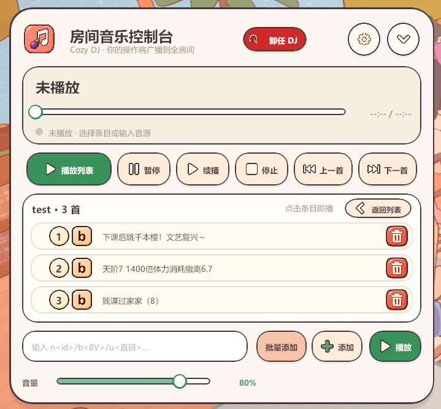

Language / 语言: [简体中文](README.md) · [English](README.en.md)

  

  <strong>Room-Synchronized Music Mod for On-Together</strong> 
  v1.0 · Windows / macOS · @茄茄w

OTMusic can synchronously play NetEase Cloud Music, audio tracks from Bilibili videos, and direct audio links in an On-Together room. Room members follow the DJ's playback content and progress, and hear different volumes according to their distance from the DJ.

  

<em>(Preview)</em>

If you want to make your social time more fun, check out the [OT-WebScreen](https://github.com/qieqieWWW/OT-Webscreen) repository.

## Installation and Usage

The complete installation and usage guide is included in the packages on the [Releases](https://github.com/qieqieWWW/OTMusic-Mod/releases) page.

## Supported Audio Sources

| Source | Input format | Example |
| --- | --- | --- |
| NetEase Cloud Music | `n` + song ID | `n3379792479` |
| Bilibili | `b` + BV ID or full video link | `bBV1rstb6dEr2` |
| Direct audio link | `u` + full URL | `uhttps://example.com/audio.mp3` |

NetEase Cloud Music VIP, region restrictions, copyright restrictions, and removed content are subject to the audio service's own access rules. OTMusic does not bypass account permissions.
